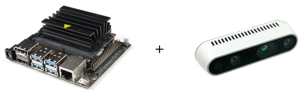

Quickstart
==========

|example|

| This quickstart is designed around the most common use case of the
| `Nvidia Jetson Nano <https://developer.nvidia.com/embedded/jetson-nano-developer-kit/>`_ + `Intel Realsense D435 <https://www.intelrealsense.com/depth-camera-d435/>`_.

Configure Nano
---------------------

0. Startup Nano
*****************
If the Nano is completely stock, please first follow Nvidia's:
`Getting Started Guide <https://developer.nvidia.com/embedded/learn/get-started-jetson-nano-devkit>`_.

For best results, install Ubuntu 18.0.4 LTS as the Nano's OS.

This is for version L4T 28.2 / L4T 28.2.1 (JetPack 3.2.1)

Current setup is working stable under ROS Kinetic. For latest ROS, we are working on it.

1. Download Drivers
********************
Install ROS Kinetic
::
	cd ~
	git clone https://github.com/jetsonhacks/installROSTX2
	./installROS.sh -p ros-kinetic-desktop -p ros-kinetic-rgbd-launch -p ros-kinetic-image-transport-plugins
	
Finish installing ROS and setup a catkin space
::
	./setupCatkinWorkspace.sh catkin_ws

2. Download Libraries
**********************
Install Open CV
::
	# Please follow the steps in this blog. 
	https://jkjung-avt.github.io/opencv3-on-tx2/
***OpenCv will be installed into path /usr/local/lib/python2.7/dist-packages
We need to modify the $PYTHONPATH globally to move rearrange the order to make python recognize Cv2.**

Configure Realsense
--------------------------

1. Download Drivers
********************

Clone Realsense Driver (ARM Linux)
::
	cd ~
	git clone https://github.com/jetsonhacks/buildLibrealsense2TX

If you would like to enable Realsense' accelerometers and gyroscopes (Optional)
::
	# The script scripts/patchKernel.sh will patch the kernel modules and Image to support the librealsense2 cameras.
	sudo ./scripts/patchKernel.sh
	# The kernel configuration modifications are in the scripts/configureKernel.sh script.
	sudo ./scripts/configureKernel.sh
Install Realsense Driver
:: 
	./installLibrealsense.sh

Install Realsense ROS Wrapper
::
	git clone https://github.com/jetsonhacks/installRealSense2ROSTX
	./installRealSenseROS.sh

-----If you successfully installed with above method, then you can skip to next section---

Official Installation Guide 

Download the Intel Realsense drivers though librealsense:
::
	# Add apt repository server key
	sudo apt-key adv --keyserver keys.gnupg.net --recv-key F6E65AC044F831AC80A06380C8B3A55A6F3EFCDE || sudo apt-key adv --keyserver hkp://keyserver.ubuntu.com:80 --recv-key F6E65AC044F831AC80A06380C8B3A55A6F3EFCDE	
	
	# Add apt repository server to local list
	sudo add-apt-repository "deb http://realsense-hw-public.s3.amazonaws.com/Debian/apt-repo bionic main" -u
	
	# Install realsense libraries
	sudo apt-get install librealsense2-dkms	
	sudo apt-get install librealsense2-utils

2. Configure settings
**********************
All of the camera settings are under `workspace/realsense2_camera/launch` folder. 
`rs_camera.launch <https://github.com/IntelRealSense/realsense-ros/blob/development/realsense2_camera/launch/rs_camera.launch>`_

You can sepcify which lens would be turn on, quality of the image, FPS, as well as other features like `align_depth_to_color`, `point_cloud`

Please enable `align_depth_to_color`. This would be able to generate a new camera stream topic which provides more accurate depth reading of the current RGB image frame.

3. Test Realsense
******************
Launch realsense with ROS Launch
::
	 `roslaunch realsense2_camera rs_camera.launch`

4. Troubleshooting and Issues
******************
**Color/Depth Synchronization Problem**

	The color and aligned depth to color frames may not arrive at the same time. point_cloud_xyz_rgb use message_filter and checking the frame_id to sync two frames. However, it would continuously give the error that two frame ids are not the same, which would not reconstruct the point cloud data.

		We have disabled the commands which checking the frame id. But we are also working on other solutions to make the frame synchronization issue.

		Potential solution would be using custom-defined message type to combine color and depth image together and send together within a message.

**Using Image Transport**

	The local reconstruct point cloud requires Color and aligned_depth_to_color frames. We applied Compressed Image Transport on the color frames and CompressedDepth Image transport on the depth (Aligned depth to color) frames.

	But in order to make the wireless transmission smoothly, we may need to set the dynamic parameters of the transport, like the compression quality.
	:: 
		#After running the camera on the joule site, open another ssh window to joule.
		rosrun dynamic_reconfigure dynparam set /camera/color/image_raw/compressed jpeg_quality 70
		rosrun dynamic_reconfigure dynparam set /camera/aligned_depth_to_color/image_raw/compressedDepth png_lev

**Realsense Missing High Quality Output**
	Usually this is caused by USB power issue. Somehow the machine did not recognize the realsense as USB 3.0, instead of USB 2.0, which it would give realsense less power to run high quality lens. 

	Try to unplug other camera or high-current-draw machine from the nano, then re-plug in the realsense and test it.

Algorithmic Framework
-----------------------------------

1. Install Pytorch / or Tensorflow  / or PyCaffee
************************************
Install PyCuda (optional)
::
	https://wiki.tiker.net/PyCuda/Installation/Linux

**Install Pytorch**

You should be able to directly download the wheel file and install them locally

https://forums.developer.nvidia.com/t/pytorch-for-jetson-nano-version-1-5-0-now-available/72048

Otherwise check this `Installation Guide <https://gist.github.com/ramonidea/0a4e6e53afa4c96204b3f215ad588d7c>`_
::
	# Modified from https://gist.github.com/dusty-nv/ef2b372301c00c0a9d3203e42fd83426

**Install Tensorflow**

https://github.com/NVIDIA-AI-IOT/tf_trt_models#setup

**Install PyCaffee**

https://jkjung-avt.github.io/caffe-on-tx2/

2. Download Model (easiest example) and run inference
************************************

**Tensorflow Example**

You should be able to run this example using Tensorflow Object detection model

https://github.com/NVIDIA-AI-IOT/tf_trt_models/blob/master/examples/detection/detection.ipynb

**PyTorch Example**

https://medium.com/@heldenkombinat/image-recognition-with-pytorch-on-the-jetson-nano-fd858a5686aa

3. Useful links
*****************

* Pytorch to Tensorflow converter

	https://github.com/NVIDIA-AI-IOT/torch2trt

* TensorRT optimized object detection model
	https://github.com/NVIDIA-AI-IOT/tf_to_trt_image_classification

